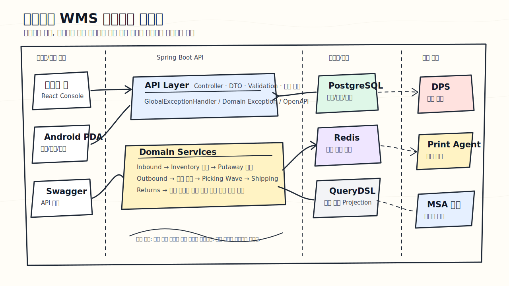

# 창고지기



3PL 물류센터의 입고, 재고, 출고, 반품 흐름을 다루는 WMS(Warehouse Management System) 백엔드 프로젝트입니다.

이 프로젝트는 단순히 주문과 상품을 CRUD로 관리하는 예제가 아니라, 물류센터에서 실제로 중요해지는 문제를 코드로 풀어보기 위해 시작했습니다. 입고된 수량이 어떤 재고로 반영되는지, 그 재고가 어느 위치에 적치되는지, 출고 요청이 들어왔을 때 어떤 수량이 할당되고 피킹되는지, 반품된 상품을 다시 판매 가능 재고로 복구해도 되는지 같은 흐름을 하나의 업무 시나리오로 연결하는 데 집중했습니다.

## 문제의식

WMS에서 재고는 단순한 숫자가 아닙니다.

같은 SKU라도 아직 출고 가능한 수량, 이미 주문에 잡힌 수량, 특정 로케이션에 놓여 있는 수량이 다릅니다. 또한 재고가 증가하거나 감소했을 때는 그 이유가 입고인지, 출고 할당인지, 출고 확정인지, 반품 복구인지 추적할 수 있어야 합니다.

창고지기는 이 지점을 중심으로 설계했습니다.

- 입고 확정 수량만 재고로 반영한다.
- 출고 지시는 바로 차감하지 않고 먼저 재고를 할당한다.
- 할당된 재고와 출고 가능한 재고를 분리한다.
- 입고 후에는 적치 작업을 생성해 위치 재고를 관리한다.
- 출고 할당 후에는 피킹 작업을 생성해 현장 작업 흐름을 분리한다.
- 반품은 상품 상태에 따라 재고 복구 여부를 다르게 처리한다.
- 모든 재고 변경은 이력으로 남긴다.

## 전체 업무 흐름

```text
입고 지시
→ 실사 입고
→ 입고 확정
→ 재고 증가
→ 적치 작업 생성
→ 위치 적치 확정

출고 지시
→ 재고 할당
→ 피킹 웨이브/작업 생성
→ 피킹 완료
→ 송장 생성/출력 요청
→ 출고 확정

반품 접수
→ 반품 실사
→ 재판매 가능 상품은 재고 복구
→ 불량 상품은 재고 복구 없이 이력 기록
```

## 구현 범위

| 도메인 | 구현 내용 |
|---|---|
| 입고 | 입고 지시 등록, 실사 입고, 입고 확정 |
| 재고 | 가용 재고, 할당 재고, 위치 재고, 재고 이력 |
| 적치 | 입고 확정 후 적치 작업 생성, 추천 위치, 확정 위치 |
| 출고 | 출고 지시 생성, 재고 할당, 출고 확정, 출고 취소 |
| 피킹 | 출고 할당 후 피킹 웨이브/작업 생성, 피킹 완료 |
| 반품 | 반품 접수, 반품 실사, 재고 복구/불량 이력 |
| 송장 | 송장 생성, 출력 요청, 출력 성공/실패 상태 관리 |

아직 실제 장비 연동은 하지 않았습니다. DPS와 프린터 연동은 추후 시뮬레이터 또는 Agent 방식으로 확장할 수 있도록 설계만 분리해두었습니다.

## 관리자 웹 화면

백엔드 API를 실제 운영자가 어떻게 사용할지 확인하기 위해 React 기반 WMS 콘솔을 함께 구성했습니다. 화면은 소개 페이지가 아니라 입고, 재고, 적치, 출고, 피킹, 송장, 반품 API를 바로 호출해보는 운영 도구 형태로 만들었습니다.


- 프론트엔드 위치: [frontend](frontend)
- 화면 구성 문서: [frontend/README.md](frontend/README.md)
- 실행 주소: `http://localhost:5173`

## 설계에서 신경 쓴 부분

### 재고 정합성

출고 요청이 들어왔을 때 바로 재고를 없애지 않고 `availableQty`와 `allocatedQty`를 나누어 관리합니다.

```text
출고 할당: availableQty 감소, allocatedQty 증가
출고 확정: allocatedQty 감소
출고 취소: allocatedQty 감소, availableQty 복구
```

동일 SKU에 대한 동시 출고 할당을 고려해 `Inventory`에는 낙관적 락을 위한 `version` 필드를 두었습니다.

### 재고 이력

현재 수량만으로는 운영자가 상황을 판단하기 어렵습니다. 그래서 입고, 출고 할당, 출고 확정, 반품, 조정 같은 모든 재고 변경을 `InventoryHistory`에 남깁니다.

```text
INBOUND
ALLOCATE
OUTBOUND
RELEASE
RETURN_INBOUND
DEFECTIVE_RETURN
ADJUST
```

### 위치 재고와 현장 작업

입고 확정은 재고 수량을 늘리는 일이고, 적치는 그 재고를 실제 창고 위치에 넣는 일입니다. 두 작업을 분리해 `InventoryLocation`과 `PutawayTask`로 관리했습니다.

출고도 마찬가지로 출고 지시와 피킹 작업을 분리했습니다. 출고 지시는 시스템의 요청이고, 피킹 작업은 현장 작업자가 수행하는 실제 작업입니다.

### 반품 처리

반품은 수량만큼 무조건 재고를 늘리면 안 됩니다. 재판매 가능한 상품인지, 불량 상품인지 검수 결과에 따라 처리해야 합니다.

```text
RESELLABLE → availableQty 복구
DEFECTIVE  → 재고 복구 없이 DEFECTIVE_RETURN 이력 기록
```

### 도메인별 예외 처리

나중에 서비스를 분리할 가능성을 고려해 예외도 도메인별 클래스로 나눴습니다.

```text
InboundOrderNotFoundException
OutboundOrderNotFoundException
ReturnOrderNotFoundException
PutawayTaskNotFoundException
PickingTaskNotFoundException
ShippingLabelNotFoundException
InsufficientStockException
```

전역 예외 핸들러는 모든 예외를 공통 응답 포맷으로 내려주고, HTTP 상태는 `ErrorCode`가 갖도록 했습니다.

### 조회 성능

지시와 품목을 함께 조회하는 구간에서는 N+1 문제가 생기기 쉽습니다. 기본 배치 사이즈를 설정하고, 품목을 반드시 순회하는 단건 처리에는 QueryDSL fetch join을 사용했습니다.

재고 목록과 재고 이력 조회는 QueryDSL DTO Projection으로 구현했습니다. 화면에 필요한 값만 조회해 엔티티를 불필요하게 영속성 컨텍스트에 올리지 않기 위해서입니다.

## 기술 스택

| 분류 | 기술 |
|---|---|
| Language | Java 17 |
| Framework | Spring Boot 3 |
| Database | PostgreSQL |
| ORM | Spring Data JPA, QueryDSL 5 |
| Cache | Redis (Lettuce) |
| API Docs | SpringDoc OpenAPI 3 |
| Infra | Docker Compose |

## 실행 방법

Docker Compose로 PostgreSQL, Redis, 백엔드를 함께 실행합니다.

```powershell
cd infra
docker compose up --build
```

Swagger UI:

```text
http://localhost:8080/swagger-ui.html
```

## 테스트

핵심 도메인 연결 흐름은 서비스 단위 테스트로 검증합니다.

```powershell
cd backend
.\gradlew.bat test
```

현재 검증한 흐름:

- 입고 확정 시 재고 증가와 적치 작업 생성
- 출고 할당 시 재고 할당과 피킹 웨이브 생성
- 재판매 가능 반품 완료 시 재고 복구
- 불량 반품 완료 시 재고 복구 없이 불량 이력 기록

## 주요 API 흐름

### 입고와 적치

```text
POST  /api/v1/inbound-orders
PATCH /api/v1/inbound-orders/{id}/receive
PATCH /api/v1/inbound-orders/{id}/confirm
GET   /api/v1/putaway-tasks?warehouseId=1&status=PENDING
PATCH /api/v1/putaway-tasks/{id}/confirm
```

### 출고와 피킹

```text
POST  /api/v1/outbound-orders
PATCH /api/v1/outbound-orders/{id}/allocate
GET   /api/v1/picking-waves?warehouseId=1&status=OPEN
PATCH /api/v1/picking-tasks/{id}/pick
POST  /api/v1/shipping-labels
POST  /api/v1/shipping-labels/{id}/print
PATCH /api/v1/outbound-orders/{id}/ship
```

### 반품

```text
POST  /api/v1/return-orders
PATCH /api/v1/return-orders/{id}/receive
PATCH /api/v1/return-orders/{id}/complete
```

## 문서

- [시스템 아키텍처](docs/architecture.md)
- [API 명세](docs/api-spec.md)
- [ERD](docs/erd.md)
- [기술 의사결정 기록](docs/design-decisions.md)
- [시연 시나리오](docs/demo-scenario.md)
- [REST Client 시연 요청](docs/demo.http)

## 앞으로 확장할 부분

- 관리자 웹 고도화: 검색 조건, 페이지네이션, 작업자별 할당 화면, 현장용 반응형 화면
- Android PDA 앱: 입고 실사, 적치, 피킹, 반품 검수
- DPS 시뮬레이터: 피킹 위치 점등 지시와 작업 확인
- 송장 PDF 다운로드 및 print-agent 연동
- 서비스 테스트, 동시성 테스트, k6 부하 테스트
