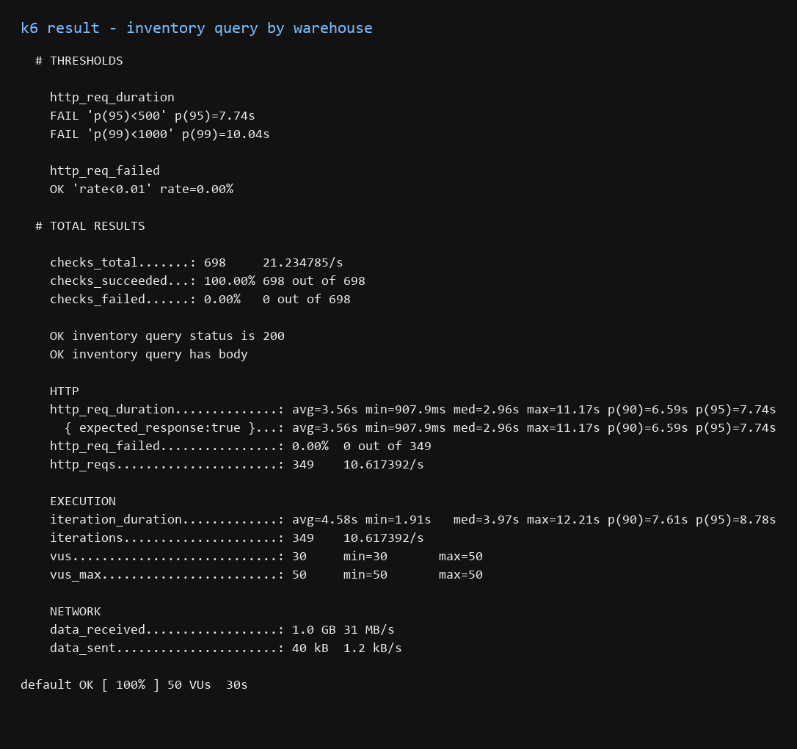
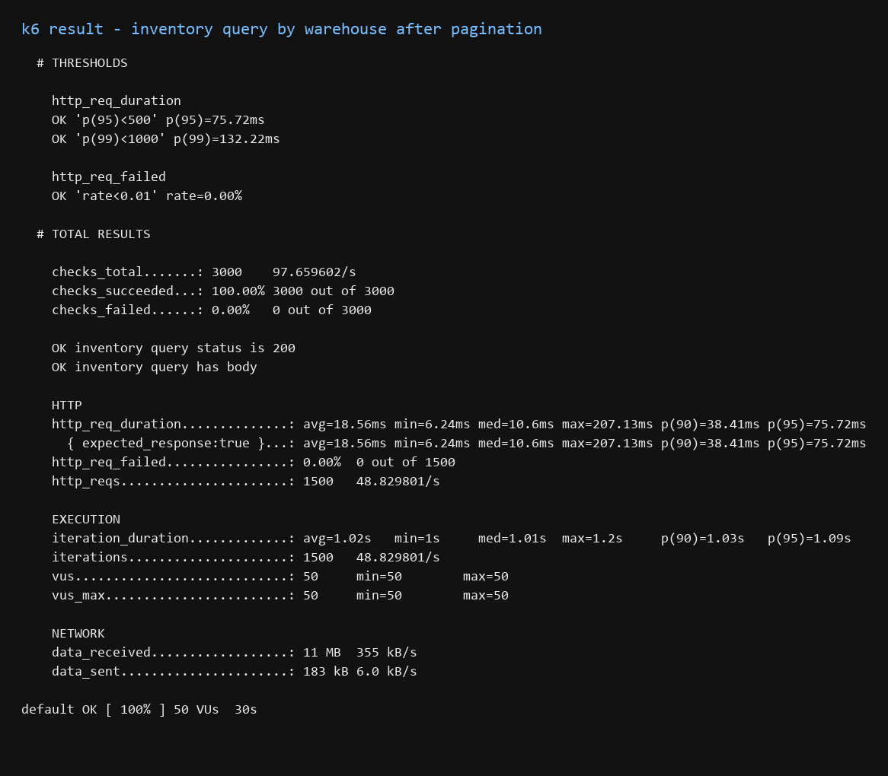
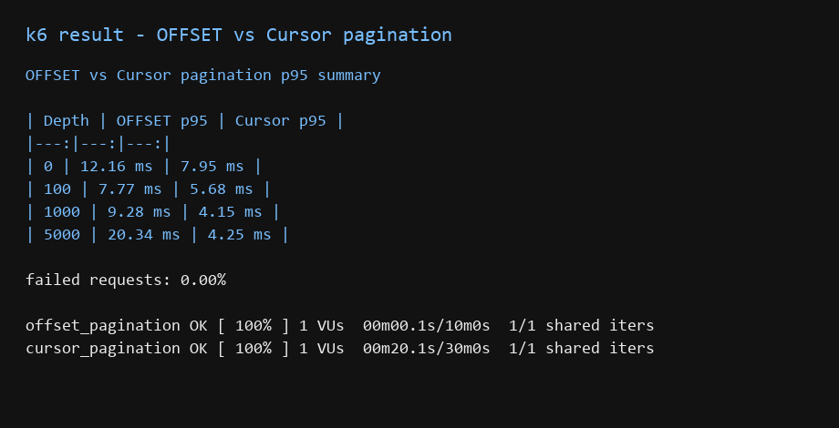

# 창고지기


3PL 물류센터의 입고, 재고, 출고, 반품 흐름을 다루는 WMS(Warehouse Management System) 백엔드 프로젝트입니다.

물류 도메인을 이해하기 위해 입고, 적치, 재고, 출고, 피킹, 반품 흐름을 하나로 연결해 구현했습니다. 입고 수량이 재고로 반영되고, 위치에 적치되고, 출고 요청에 할당되고, 반품 상태에 따라 재고로 복구되는 과정을 코드로 확인하는 것이 목표입니다.

## 문제

WMS에서 재고는 단순한 수량 하나로 관리하기 어렵습니다.

같은 SKU라도 출고 가능한 수량, 주문에 할당된 수량, 특정 로케이션에 놓인 수량이 다릅니다. 재고가 늘거나 줄었을 때 그 이유가 입고, 출고 할당, 출고 확정, 반품 복구, 조정 중 무엇인지도 남아야 합니다.

이 프로젝트에서는 아래 기준으로 재고 흐름을 잡았습니다.

- 입고 확정 수량만 재고로 반영한다.
- 출고 지시는 바로 차감하지 않고 먼저 재고를 할당한다.
- 할당된 재고와 출고 가능한 재고를 분리한다.
- 입고 후에는 적치 작업을 생성해 위치 재고를 관리한다.
- 출고 할당 후에는 피킹 작업을 생성해 현장 작업 흐름을 분리한다.
- 반품은 상품 상태에 따라 재고 복구 여부를 다르게 처리한다.
- 모든 재고 변경은 이력으로 남긴다.

## 전체 업무 흐름

```text
입고 지시
→ 실사 입고
→ 입고 확정
→ 재고 증가
→ 적치 작업 생성
→ 위치 적치 확정

출고 지시
→ 재고 할당
→ 피킹 웨이브/작업 생성
→ 피킹 완료
→ 송장 생성/출력 요청
→ 출고 확정

반품 접수
→ 반품 실사
→ 재판매 가능 상품은 재고 복구
→ 불량 상품은 재고 복구 없이 이력 기록
```

## 구현 범위

| 도메인 | 구현 내용 |
|---|---|
| 입고 | 입고 지시 등록, 실사 입고, 입고 확정 |
| 재고 | 가용 재고, 할당 재고, 위치 재고, 재고 이력 |
| 적치 | 입고 확정 후 적치 작업 생성, 추천 위치, 확정 위치 |
| 출고 | 출고 지시 생성, 재고 할당, 출고 확정, 출고 취소 |
| 피킹 | 출고 할당 후 피킹 웨이브/작업 생성, 피킹 완료 |
| 반품 | 반품 접수, 반품 실사, 재고 복구/불량 이력 |
| 송장 | 송장 생성, 출력 요청, 출력 성공/실패 상태 관리 |

실제 장비 연동은 포함하지 않았습니다. DPS와 프린터 연동은 이후 시뮬레이터나 Agent 방식으로 붙일 수 있도록 도메인만 분리했습니다.

## 관리자 웹 화면

백엔드 API를 화면에서 직접 확인할 수 있도록 React 기반 WMS 콘솔을 구성했습니다. 소개 페이지가 아니라 입고, 재고, 적치, 출고, 피킹, 송장, 반품 API를 바로 호출하는 운영 도구 형태입니다.


- 프론트엔드 위치: [frontend](frontend)
- 화면 구성 문서: [frontend/README.md](frontend/README.md)
- 실행 주소: `http://localhost:5173`

## 설계 기준

### 재고 정합성

출고 요청이 들어와도 재고를 바로 차감하지 않고 `availableQty`와 `allocatedQty`를 나누어 관리합니다.

```text
출고 할당: availableQty 감소, allocatedQty 증가
출고 확정: allocatedQty 감소
출고 취소: allocatedQty 감소, availableQty 복구
```

동일 SKU에 대한 동시 출고 할당을 고려해 `Inventory`에 낙관적 락용 `version` 필드를 두었습니다.

### 재고 이력

현재 수량만 보면 왜 재고가 변했는지 알기 어렵습니다. 입고, 출고 할당, 출고 확정, 반품, 조정 같은 재고 변경을 `InventoryHistory`에 남깁니다.

```text
INBOUND
ALLOCATE
OUTBOUND
RELEASE
RETURN_INBOUND
DEFECTIVE_RETURN
ADJUST
```

### 위치 재고와 현장 작업

입고 확정은 재고 수량을 늘리는 일이고, 적치는 그 재고를 실제 창고 위치에 넣는 일입니다. 두 작업을 `InventoryLocation`과 `PutawayTask`로 분리했습니다.

출고도 출고 지시와 피킹 작업을 분리했습니다. 출고 지시는 시스템 요청이고, 피킹 작업은 현장 작업자가 수행하는 작업입니다.

### 반품 처리

반품은 수량만큼 무조건 재고를 늘리면 안 됩니다. 재판매 가능 상품인지 불량 상품인지에 따라 처리합니다.

```text
RESELLABLE → availableQty 복구
DEFECTIVE  → 재고 복구 없이 DEFECTIVE_RETURN 이력 기록
```

### 도메인별 예외 처리

나중에 서비스를 분리할 가능성을 고려해 예외를 도메인별 클래스로 나눴습니다.

```text
InboundOrderNotFoundException
OutboundOrderNotFoundException
ReturnOrderNotFoundException
PutawayTaskNotFoundException
PickingTaskNotFoundException
ShippingLabelNotFoundException
InsufficientStockException
```

전역 예외 핸들러는 예외를 공통 응답 포맷으로 변환하고, HTTP 상태는 `ErrorCode`에서 관리합니다.

### 조회 성능

지시와 품목을 함께 조회하는 구간에서는 N+1 문제가 생기기 쉽습니다. 기본 배치 사이즈를 설정하고, 품목을 순회하는 단건 처리에는 QueryDSL fetch join을 사용했습니다.

재고 목록과 재고 이력 조회는 QueryDSL DTO Projection으로 구현했습니다. 화면에 필요한 값만 조회하고, 엔티티를 불필요하게 영속성 컨텍스트에 올리지 않기 위해서입니다.

## 기술 스택

| 분류 | 기술 |
|---|---|
| Language | Java 17 |
| Framework | Spring Boot 3 |
| Database | PostgreSQL |
| ORM | Spring Data JPA, QueryDSL 5 |
| Cache | Redis (Lettuce) |
| API Docs | SpringDoc OpenAPI 3 |
| Infra | Docker Compose |

## 실행 방법

Docker Compose로 PostgreSQL, Redis, 백엔드를 함께 실행합니다.

```powershell
cd infra
docker compose up --build
```

Swagger UI:

```text
http://localhost:8080/swagger-ui.html
```

기존에 띄운 PostgreSQL 볼륨이 남아 있는데 테이블 구조가 바뀐 경우에는 `ddl-auto=validate`에서 서버가 뜨지 않을 수 있습니다. 개발 환경에서 초기 데이터가 중요하지 않다면 아래처럼 볼륨까지 지운 뒤 다시 실행하면 `infra/db/init.sql` 기준으로 새로 만들어집니다.

```powershell
cd infra
docker compose down -v
docker compose up --build
```

## 테스트

핵심 도메인 연결 흐름은 서비스 단위 테스트로 검증합니다.

```powershell
cd backend
.\gradlew.bat test
```

현재 검증한 흐름:

- 입고 확정 시 재고 증가와 적치 작업 생성
- 출고 할당 시 재고 할당과 피킹 웨이브 생성
- 재판매 가능 반품 완료 시 재고 복구
- 불량 반품 완료 시 재고 복구 없이 불량 이력 기록

## 성능 측정용 시딩

인덱스 성능 비교와 페이지네이션 실측을 위해 `seed` 프로필에서만 동작하는 대량 데이터 시딩 러너를 제공합니다. JPA `save` 루프가 아니라 `JdbcTemplate` batch insert로 `inventory` 10만 행, `inventory_history` 50만 행을 생성합니다.

```powershell
cd backend
.\gradlew.bat bootRun --args='--spring.profiles.active=seed'
```

이미 `inventory` 테이블에 데이터가 있으면 중복 삽입을 막기 위해 시딩을 건너뜁니다.

## 성능 테스트

조회 성능은 `EXPLAIN ANALYZE`와 k6로 확인했습니다. DB 실행계획과 API 응답시간을 함께 봤습니다.

- 스크립트 위치: [k6](k6)
- 인덱스 실행계획 비교 문서: [docs/README-explain-analyze.md](docs/README-explain-analyze.md)
- 측정 환경: 로컬 Spring Boot, Docker PostgreSQL
- 데이터셋: `inventory` 100,000건, `inventory_history` 620,000건
- 페이지네이션 비교 대상: `inventory_id=1`, 이력 120,005건

### 복합 인덱스 실행계획 비교

`inventory` 테이블에서 자주 쓰는 조회 조건을 기준으로 복합 인덱스 순서를 비교했습니다.

```text
Variant A: (warehouse_id, sku_id)
Variant B: (sku_id, warehouse_id)
```

| Query | Variant A `(warehouse_id, sku_id)` | Variant B `(sku_id, warehouse_id)` | 판단 |
|---|---:|---:|---|
| 창고 단위 전체 조회 | 2.385ms | 5.672ms | A가 유리 |
| 창고 + SKU 단건 조회 | 0.068ms | 0.185ms | 둘 다 빠르지만 A가 더 빠름 |
| SKU 단독 조회 | 3.320ms | 0.392ms | B가 유리 |

창고 작업자가 "내 창고의 재고 목록"을 조회하는 흐름을 주요 패턴으로 보면 기본 인덱스는 `(warehouse_id, sku_id)`가 맞습니다. 특정 SKU가 여러 창고에 얼마나 있는지 자주 조회하는 화면이 생기면 `sku_id` 기준 보조 인덱스를 추가하는 방식이 낫습니다.


`(warehouse_id, sku_id)` 인덱스에서는 창고 단위 조회가 `Bitmap Heap Scan`으로 실행됐고, 20,000건 조회 기준 2.385ms가 나왔습니다.


`(sku_id, warehouse_id)` 인덱스에서는 같은 창고 단위 조회가 이번 실행에서 `Seq Scan`으로 선택됐습니다. 이 인덱스를 절대 사용할 수 없다는 뜻은 아닙니다. `warehouse_id = 3` 결과가 전체의 약 20%라 선택도가 낮고, 조건 컬럼이 인덱스 선두가 아니어서 PostgreSQL 옵티마이저가 순차 스캔을 선택한 결과입니다.

### 테스트 중 발견한 문제

처음 k6를 실행했을 때 새로 추가한 재고 이력 페이지네이션 API가 `500`을 반환했습니다. 실행 중이던 `8080` 서버가 예전 코드 상태였고, 최신 코드로 별도 포트에서 다시 띄운 서버는 정상 동작했습니다.

이 과정에서 설정 문제도 발견했습니다. 기본 `application.yml`의 JPA 설정이 `ddl-auto=create-drop`으로 되어 있어 서버를 다시 띄우는 순간 PostgreSQL의 시딩 데이터가 삭제될 수 있었습니다. 실제로 테스트 중 `inventory`, `inventory_history` 데이터가 비어 있었습니다.

```yaml
spring:
  jpa:
    hibernate:
      ddl-auto: validate
```

성능 측정용 데이터는 애플리케이션 재시작으로 사라지면 안 됩니다. 기본 설정을 `validate`로 바꿔 서버는 스키마만 검증하고, 데이터 생성은 Docker 초기화 SQL과 seed 프로필이 담당하도록 분리했습니다.

### 창고 단위 재고 조회



창고 재고 목록 API는 VU 50, 30초 동안 `warehouseId`를 1~5 랜덤으로 호출했습니다.

```text
GET /api/v1/inventories?warehouseId={1~5}
```

요청 실패율은 0%였지만 p95는 7.74초, p99는 10.04초였습니다. 원인은 쿼리뿐 아니라 창고 하나를 조회할 때 약 20,000건의 재고 목록을 한 번에 반환하는 응답 구조였습니다.

그래서 같은 API에 `page`, `size` 파라미터를 추가하고 기본 `size=50`, 최대 `size=200`으로 제한했습니다.

```text
GET /api/v1/inventories?warehouseId={id}&page=0&size=50
```



| 항목 | 페이지네이션 전 | 페이지네이션 후 |
|---|---:|---:|
| http_req_duration p95 | 7.74s | 75.72ms |
| http_req_duration p99 | 10.04s | 132.22ms |
| data_received | 1.0GB / 30s | 11MB / 30s |
| threshold | FAIL | PASS |

DB 인덱스 적용 후에도 API 응답이 느릴 수 있습니다. 이 경우 병목은 쿼리 실행 시간이 아니라 JSON 직렬화와 네트워크 전송량이었습니다. 창고 단위 재고 조회는 페이지네이션이 기본이고, 이후에는 SKU 검색 조건과 위치별 필터를 추가하는 방향이 맞습니다.

### OFFSET vs Cursor 페이지네이션



재고 이력 조회는 OFFSET 방식과 Cursor 방식을 같은 데이터셋으로 비교했습니다.

```text
GET /api/v1/inventories/{id}/history/offset?page={page}&size=20
GET /api/v1/inventories/{id}/history/cursor?cursor={lastId}&size=20
```

| Depth | OFFSET p95 | Cursor p95 |
|---:|---:|---:|
| 0 | 12.16ms | 7.95ms |
| 100 | 7.77ms | 5.68ms |
| 1000 | 9.28ms | 4.15ms |
| 5000 | 20.34ms | 4.25ms |

OFFSET은 깊은 페이지로 갈수록 앞 데이터를 건너뛰는 비용이 커졌고, 5000 페이지에서 p95가 20.34ms까지 증가했습니다. Cursor 방식은 마지막 ID를 기준으로 다음 범위를 조회하기 때문에 페이지 깊이가 깊어져도 4~8ms 수준을 유지했습니다.

이 테스트는 배포 환경의 절대 성능 측정이 아니라, 같은 로컬 환경과 같은 데이터셋에서 조회 방식만 바꿨을 때의 차이를 보기 위한 실험입니다.

## 주요 API 흐름

### 입고와 적치

```text
POST  /api/v1/inbound-orders
PATCH /api/v1/inbound-orders/{id}/receive
PATCH /api/v1/inbound-orders/{id}/confirm
GET   /api/v1/putaway-tasks?warehouseId=1&status=PENDING
PATCH /api/v1/putaway-tasks/{id}/confirm
```

### 출고와 피킹

```text
POST  /api/v1/outbound-orders
PATCH /api/v1/outbound-orders/{id}/allocate
GET   /api/v1/picking-waves?warehouseId=1&status=OPEN
PATCH /api/v1/picking-tasks/{id}/pick
POST  /api/v1/shipping-labels
POST  /api/v1/shipping-labels/{id}/print
PATCH /api/v1/outbound-orders/{id}/ship
```

### 반품

```text
POST  /api/v1/return-orders
PATCH /api/v1/return-orders/{id}/receive
PATCH /api/v1/return-orders/{id}/complete
```

## 문서

- [시스템 아키텍처](docs/architecture.md)
- [API 명세](docs/api-spec.md)
- [ERD](docs/erd.md)
- [기술 의사결정 기록](docs/design-decisions.md)
- [시연 시나리오](docs/demo-scenario.md)
- [REST Client 시연 요청](docs/demo.http)

## 앞으로 확장할 부분

- Android PDA 앱: 입고 실사, 적치, 피킹, 반품 검수
- DPS 시뮬레이터: 피킹 위치 점등 지시와 작업 확인
- 송장 PDF 다운로드 및 print-agent 연동
- 재고 목록 페이지네이션과 검색 조건 고도화
