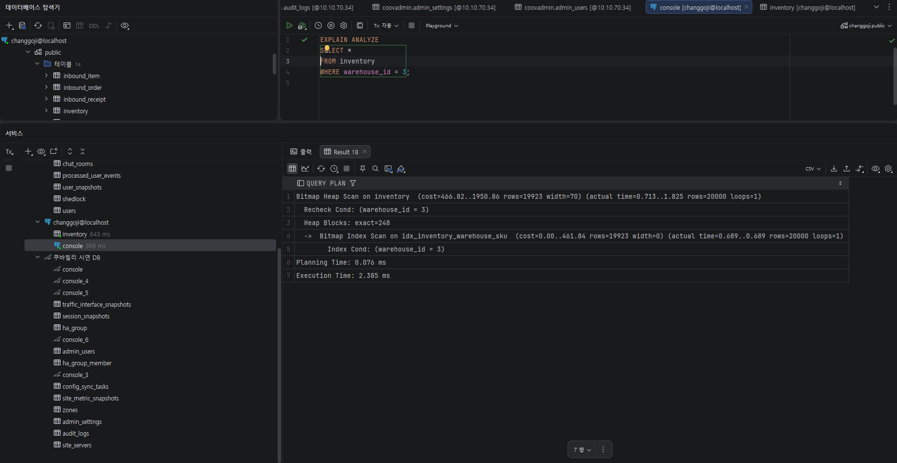
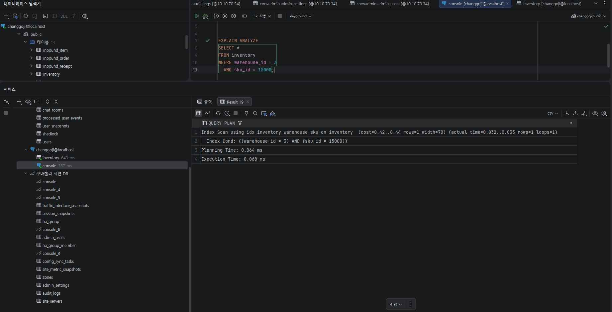
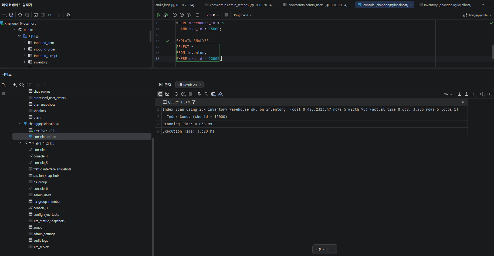
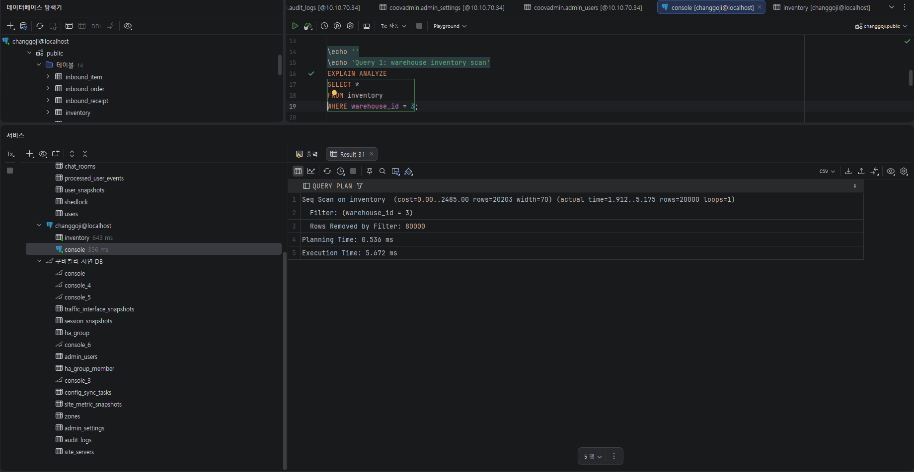
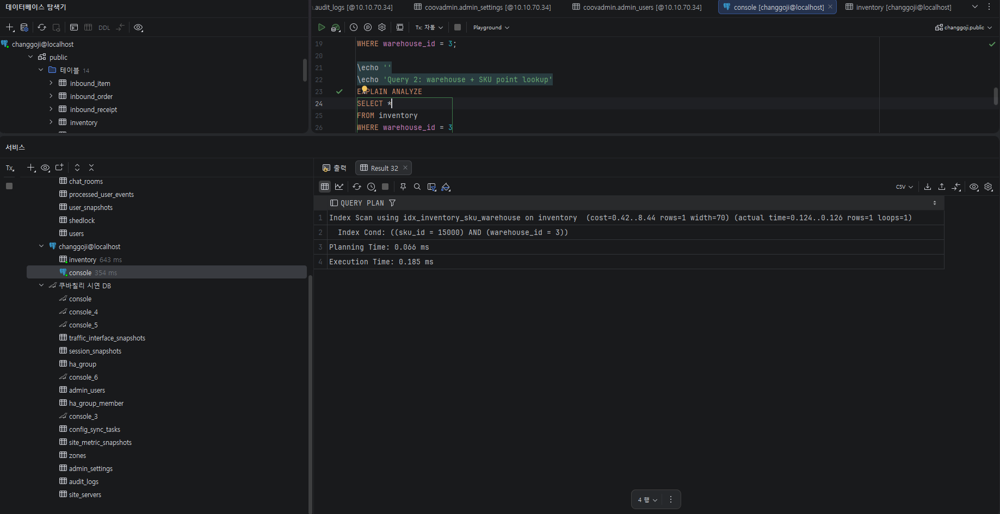
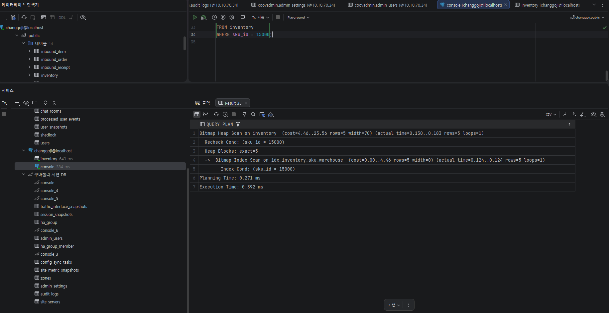

# Inventory 인덱스 실행계획 비교

`inventory` 테이블의 복합 인덱스 컬럼 순서에 따른 실행계획 차이를 비교한다.

- 현재 후보 A: `(warehouse_id, sku_id)`
- 비교 후보 B: `(sku_id, warehouse_id)`
- 데이터 특성:
  - `warehouse_id`: 1~5, 낮은 카디널리티
  - `sku_id`: 1~20000, 높은 카디널리티
  - `inventory`: 100,000 rows
  - `inventory_history`: 500,000 rows

## 실행 전 준비

대량 시딩 데이터가 없다면 먼저 seed 프로필로 데이터를 만든다.

```powershell
cd backend
.\gradlew.bat bootRun --args='--spring.profiles.active=seed'
```

로컬 파일을 직접 실행할 때는 아래처럼 `psql`에 파일 경로를 넘긴다.

```powershell
psql -h localhost -p 5432 -U changgoji -d changgoji -f infra/db/index-variant-a.sql
psql -h localhost -p 5432 -U changgoji -d changgoji -f infra/db/index-variant-b.sql
psql -h localhost -p 5432 -U changgoji -d changgoji -f infra/db/restore-index.sql
```

Docker 컨테이너 안에서 실행하려면 파일을 컨테이너로 복사하거나 표준 입력으로 전달한다.

```powershell
docker exec -i changgoji-postgres psql -U changgoji -d changgoji < infra/db/index-variant-a.sql
docker exec -i changgoji-postgres psql -U changgoji -d changgoji < infra/db/index-variant-b.sql
docker exec -i changgoji-postgres psql -U changgoji -d changgoji < infra/db/restore-index.sql
```

## 실행 순서

1. `index-variant-a.sql` 실행
2. 쿼리 1~3의 `EXPLAIN ANALYZE` 결과 기록
3. `index-variant-b.sql` 실행
4. 쿼리 1~3의 `EXPLAIN ANALYZE` 결과 기록
5. `restore-index.sql` 실행

## 비교 쿼리

| 번호 | 목적 | SQL |
|---|---|---|
| Query 1 | 창고 단위 전체 조회 | `SELECT * FROM inventory WHERE warehouse_id = 3;` |
| Query 2 | 창고 + SKU 단건 조회 | `SELECT * FROM inventory WHERE warehouse_id = 3 AND sku_id = 15000;` |
| Query 3 | 특정 SKU의 전체 창고 재고 조회 | `SELECT * FROM inventory WHERE sku_id = 15000;` |

## 측정 결과

이번 측정은 시딩 데이터 100,000건 기준으로 진행했다. 각 결과는 같은 쿼리를 인덱스 순서만 바꿔 실행한 캡처를 기준으로 정리했다.

### Variant A: `(warehouse_id, sku_id)`

적용 인덱스:

```sql
CREATE INDEX idx_inventory_warehouse_sku
ON inventory (warehouse_id, sku_id);
```

| Query | SQL | Scan Type | Index Name | Cost | Plan Rows | Actual Rows | Execution Time | 메모 |
|---|---|---|---|---:|---:|---:|---:|---|
| Query 1 | `SELECT * FROM inventory WHERE warehouse_id = 3;` | Bitmap Heap Scan | idx_inventory_warehouse_sku | 466.82..1950.86 | 19,923 | 20,000 | 2.385ms | 창고별 재고 조회. 선두 컬럼이 조건에 있어 Bitmap Index Scan 사용 |
| Query 2 | `SELECT * FROM inventory WHERE warehouse_id = 3 AND sku_id = 15000;` | Index Scan | idx_inventory_warehouse_sku | 0.42..8.44 | 1 | 1 | 0.068ms | 창고 + SKU 단건 조회. 두 조건 모두 Index Cond 처리 |
| Query 3 | `SELECT * FROM inventory WHERE sku_id = 15000;` | Index Scan | idx_inventory_warehouse_sku | 0.42..2313.47 | 5 | 5 | 3.320ms | SKU 단독 조회. 선두 컬럼이 빠져 비용과 시간이 커짐 |

#### Query 1 캡처



#### Query 2 캡처



#### Query 3 캡처



### Variant B: `(sku_id, warehouse_id)`

적용 인덱스:

```sql
DROP INDEX IF EXISTS idx_inventory_warehouse_sku;

CREATE INDEX idx_inventory_sku_warehouse
ON inventory (sku_id, warehouse_id);
```

| Query | SQL | Scan Type | Index Name | Cost | Plan Rows | Actual Rows | Execution Time | 메모 |
|---|---|---|---|---:|---:|---:|---:|---|
| Query 1 | `SELECT * FROM inventory WHERE warehouse_id = 3;` | Seq Scan | 없음 | 0.00..2485.00 | 20,203 | 20,000 | 5.672ms | 선두 컬럼 `sku_id`가 조건에 없어 옵티마이저가 인덱스보다 Seq Scan이 낫다고 판단 |
| Query 2 | `SELECT * FROM inventory WHERE warehouse_id = 3 AND sku_id = 15000;` | Index Scan | idx_inventory_sku_warehouse | 0.42..8.44 | 1 | 1 | 0.185ms | 두 조건이 모두 있어 인덱스 사용 가능 |
| Query 3 | `SELECT * FROM inventory WHERE sku_id = 15000;` | Bitmap Heap Scan | idx_inventory_sku_warehouse | 4.46..23.56 | 5 | 5 | 0.392ms | SKU 단독 조회에서는 선두 컬럼이 맞아 가장 빠름 |

#### Query 1 캡처



#### Query 2 캡처



#### Query 3 캡처



### 한눈에 비교

| Query | Variant A `(warehouse_id, sku_id)` | Variant B `(sku_id, warehouse_id)` | 판단 |
|---|---:|---:|---|
| Query 1: 창고 단위 전체 조회 | 2.385ms | 5.672ms | A가 유리 |
| Query 2: 창고 + SKU 단건 조회 | 0.068ms | 0.185ms | 둘 다 빠르지만 A가 더 빠름 |
| Query 3: SKU 단독 조회 | 3.320ms | 0.392ms | B가 유리 |

## 결과 분석

### 가정과 실측 비교

가정: `warehouse_id` 카디널리티(5)가 `sku_id` 카디널리티(20,000)보다 훨씬 낮으므로, 창고 단위 조회가 잦은 WMS 특성상 `warehouse_id`를 선두 컬럼으로 두는 것이 유리할 것이다.

실측 결과는 쿼리 패턴별로 차이가 명확했다.

**Query 1 (창고 단위 전체 조회)** — `(warehouse_id, sku_id)`는 `Bitmap Heap Scan`으로 2.385ms가 나왔고, `(sku_id, warehouse_id)`는 이번 실행에서 `Seq Scan`으로 5.672ms가 나왔다. `(sku_id, warehouse_id)` 인덱스가 있다고 해서 `warehouse_id` 조건에서 절대 사용할 수 없다는 뜻은 아니다. 다만 이 데이터에서는 `warehouse_id = 3` 결과가 전체의 약 20%라 선택도가 낮고, 조건 컬럼이 인덱스 선두가 아니어서 PostgreSQL 옵티마이저가 인덱스 스캔보다 순차 스캔이 낫다고 판단한 것이다. 실제 서비스에서 창고 작업자는 보통 "내 창고의 재고 목록"을 먼저 보기 때문에 이 쿼리가 가장 중요하다. 이 결과만 놓고 보면 기본 인덱스의 선두 컬럼은 `warehouse_id`가 맞다.

**Query 2 (창고 + SKU 단건 조회)** — 두 인덱스 모두 `Index Scan`을 탔다. 다만 `(warehouse_id, sku_id)`가 0.068ms, `(sku_id, warehouse_id)`가 0.185ms로 A가 더 빨랐다. 두 컬럼이 모두 동등 조건이면 컬럼 순서의 영향이 Query 1이나 Query 3만큼 크지는 않지만, 현재 서비스의 대표 조회 조건에서는 A가 더 안정적이다.

**Query 3 (SKU 단독 조회, 멀티 창고 합산)** — `(sku_id, warehouse_id)`가 0.392ms로 훨씬 빨랐다. 반대로 `(warehouse_id, sku_id)`는 3.320ms가 나왔다. 본사 화면에서 "이 SKU가 어느 창고에 얼마나 있는지"를 자주 조회한다면 `sku_id` 기준 보조 인덱스를 따로 검토할 만하다.

### 결론

WMS의 주 조회 패턴은 "창고 작업자가 자신이 속한 창고의 재고를 조회"하는 시나리오이며, Query 1·2가 이에 해당한다. 두 쿼리 모두 `(warehouse_id, sku_id)`에서 더 나은 성능을 보였으므로 현재 인덱스 순서를 유지하는 것이 타당하다.

다만 Query 3 같은 "여러 창고에 걸친 동일 SKU 조회"가 향후 빈번해진다면(예: 본사 재고 통합 조회, 창고 간 재고 이동 추천) 기존 인덱스를 뒤집기보다는 `sku_id` 기준 보조 인덱스를 별도로 추가하는 쪽이 낫다.

```sql
CREATE INDEX idx_inventory_sku
ON inventory (sku_id);
```

두 인덱스를 모두 유지하면 INSERT/UPDATE 시 인덱스 갱신 비용이 늘어난다. 그래서 지금 단계에서는 `(warehouse_id, sku_id)`를 기본 인덱스로 유지하고, SKU 단독 조회가 실제 화면이나 API에서 자주 호출되는지 확인한 뒤 보조 인덱스를 추가하는 방향이 합리적이다.

추가로, Query 1에서 `Bitmap Heap Scan`이 선택된 것은 "인덱스가 있어도 항상 Index Scan으로 실행되지는 않는다"는 점을 보여준다. 조회 결과가 전체 테이블의 20% 정도로 크면 PostgreSQL 옵티마이저는 인덱스로 위치를 모은 뒤 Heap을 묶어서 읽는 방식을 선택할 수 있다.

## 해석 포인트

- Query 1은 `warehouse_id`만 조건에 있으므로 `(warehouse_id, sku_id)`가 유리할 가능성이 높다.
- Query 2는 두 컬럼이 모두 동등 조건이라 두 인덱스 모두 효과가 있을 수 있다.
- Query 3은 `sku_id`만 조건에 있으므로 `(sku_id, warehouse_id)`가 유리할 가능성이 높다.
- 최종 인덱스 선택은 가장 자주 호출되는 조회 패턴과 쓰기 비용까지 같이 보고 결정한다.
