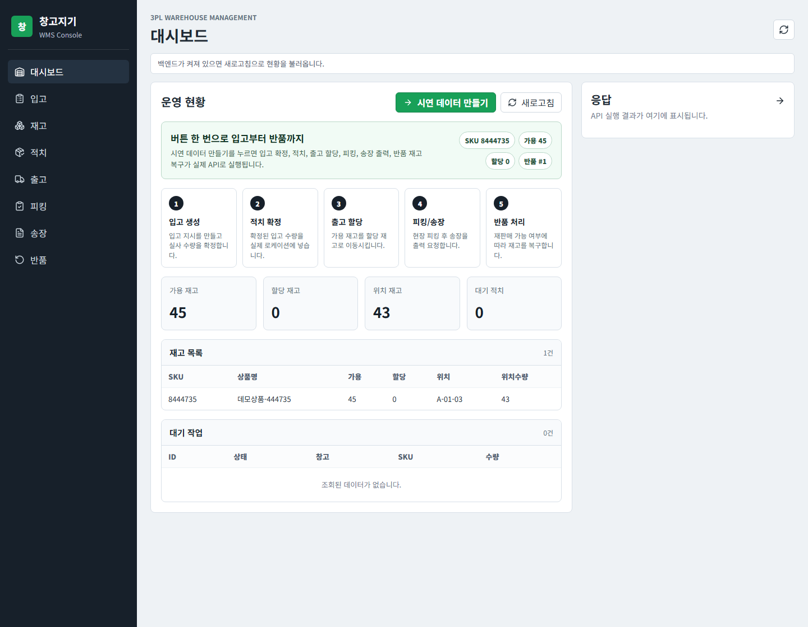
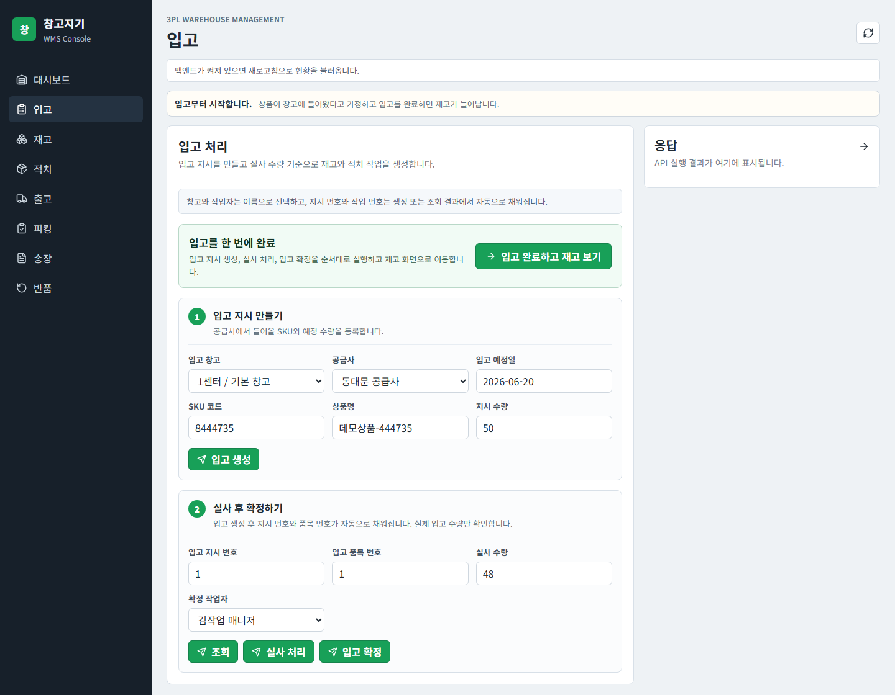
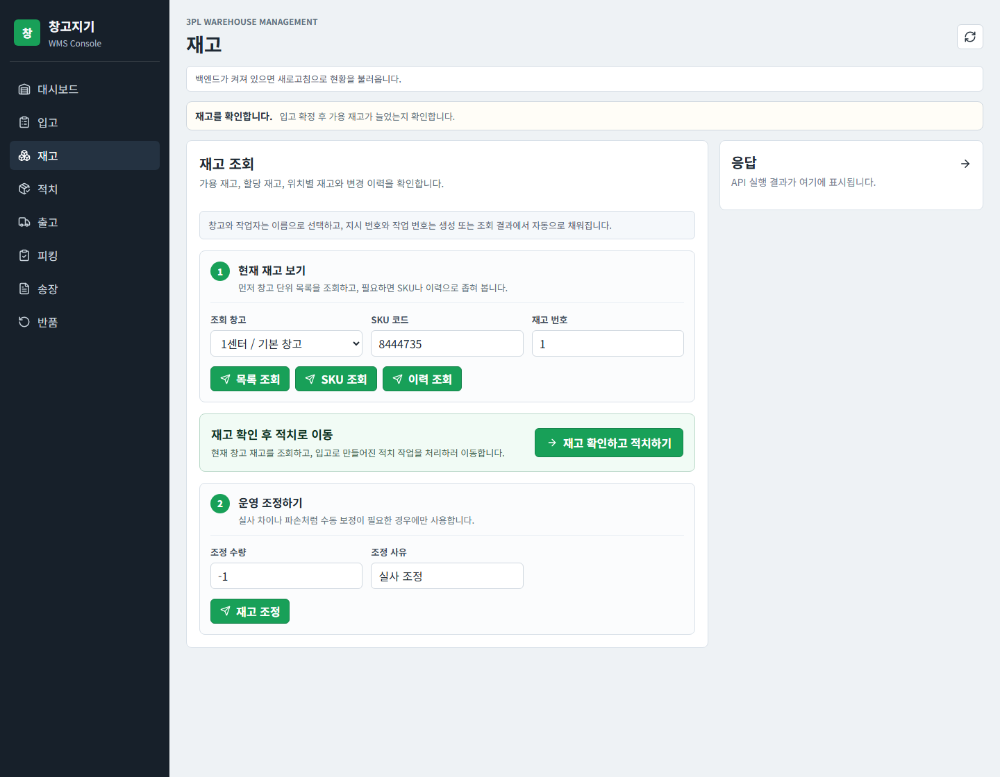
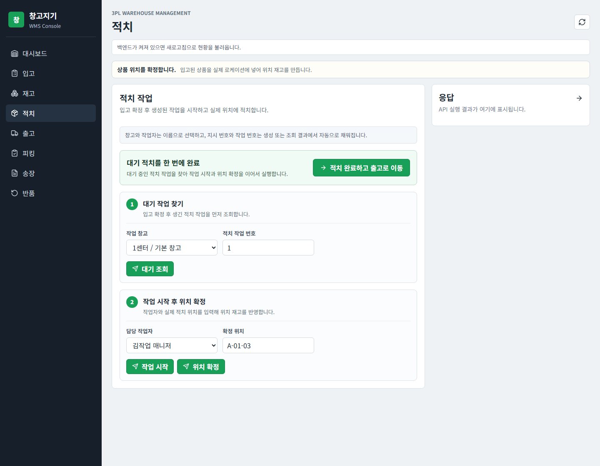
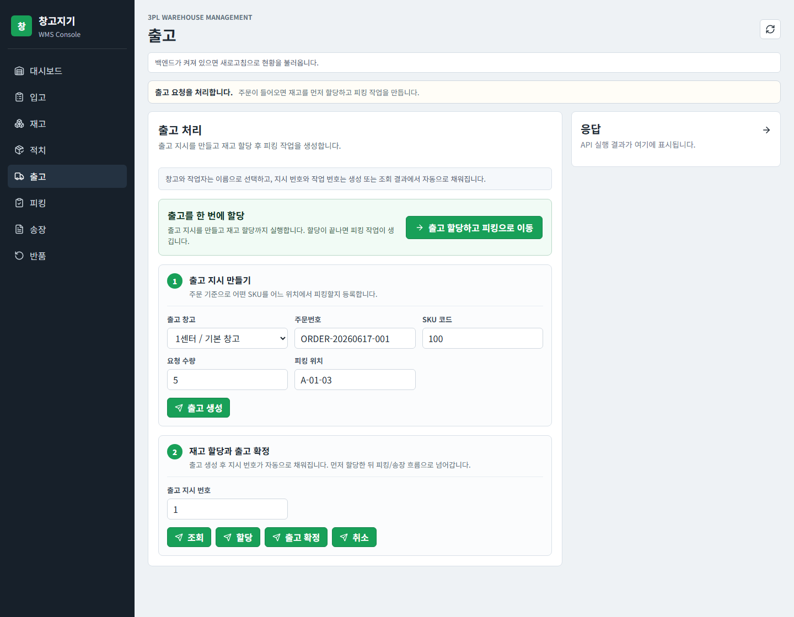
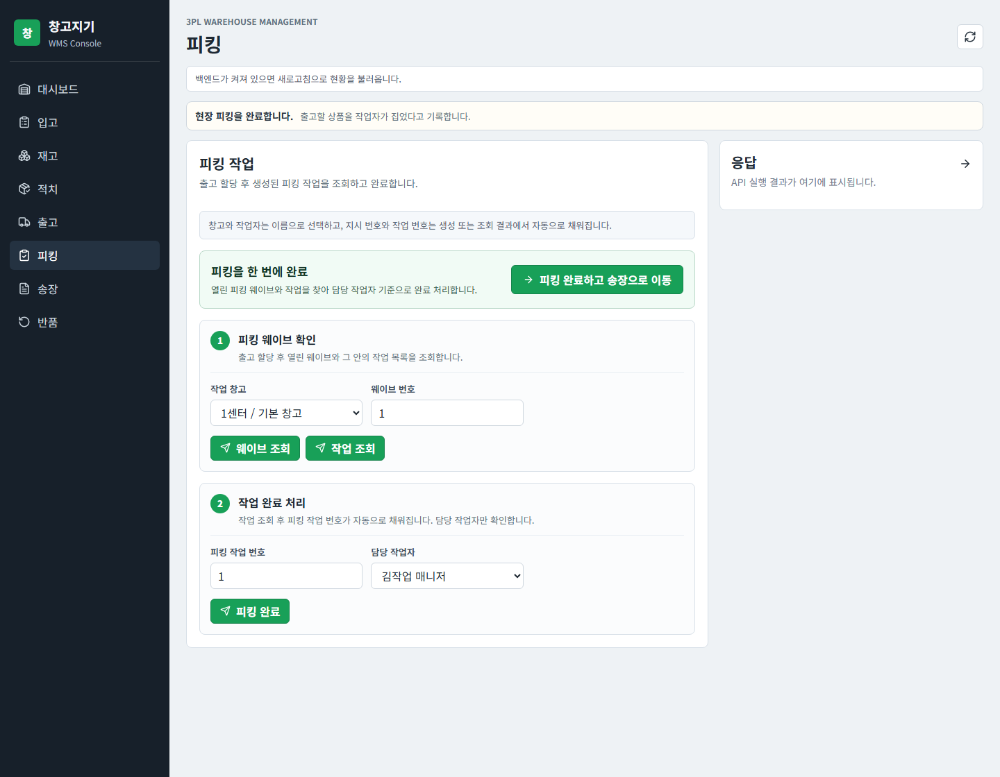
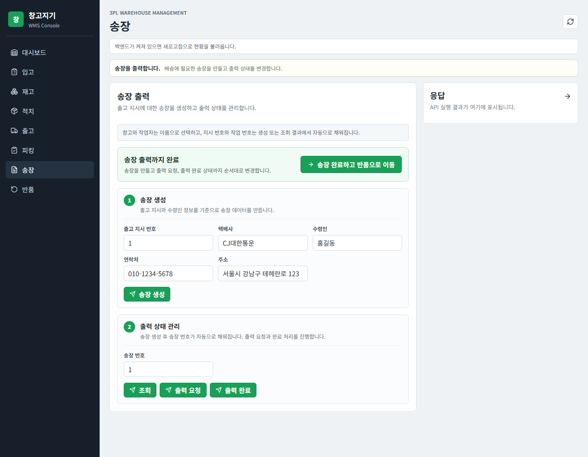
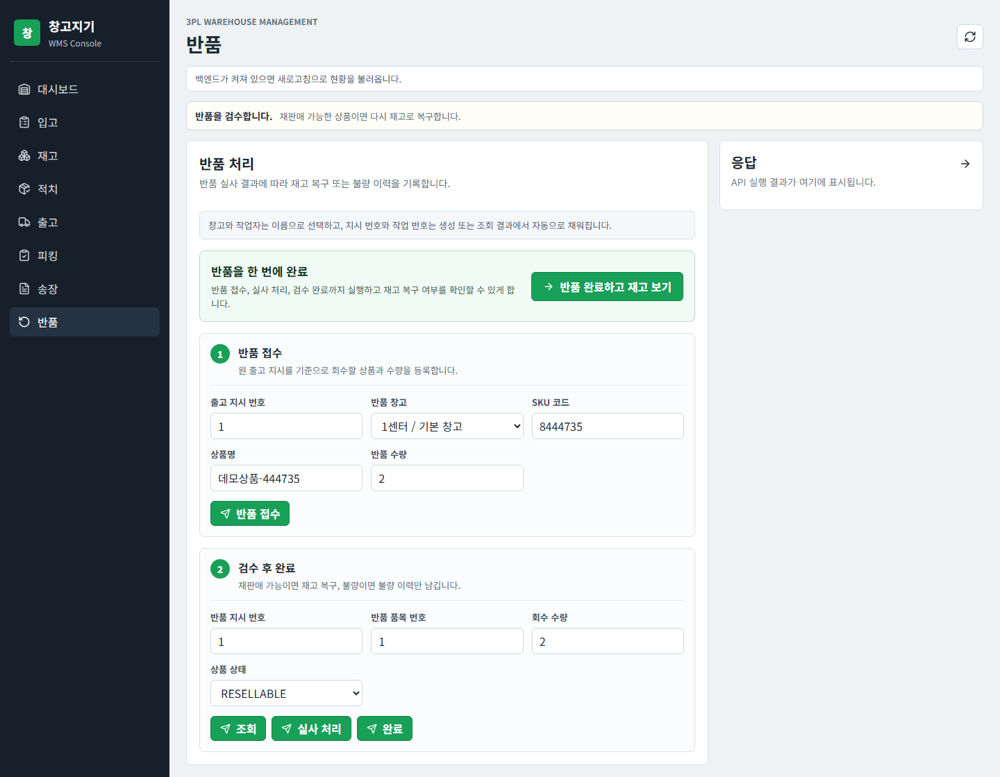

# 창고지기 Frontend

창고지기 백엔드 API를 운영 흐름대로 확인하기 위한 WMS 관리자 콘솔입니다.

단순한 소개 페이지가 아니라 입고 지시 등록, 재고 조회, 적치 작업, 출고 할당, 피킹, 송장, 반품 처리처럼 물류센터 운영자가 매일 보는 작업 단위를 기준으로 화면을 나눴습니다.

## 실행 방법

```powershell
cd frontend
npm install
npm run dev
```

개발 서버는 기본적으로 `http://localhost:5173`에서 실행됩니다. API 요청은 Vite proxy를 통해 `http://localhost:8080/api/v1` 백엔드로 전달됩니다.

## 화면 구성

### 대시보드

운영자가 먼저 확인해야 하는 가용 재고, 할당 재고, 위치 재고, 대기 적치 작업을 요약해서 보여줍니다.



### 입고

입고 지시 등록, 실사 수량 입력, 입고 확정을 한 화면에서 확인할 수 있습니다. 입고 확정 이후 재고 증가와 적치 작업 생성 흐름을 이어서 검증하는 용도입니다.



### 재고

창고별 재고 목록, SKU 단건 조회, 재고 이력 조회, 재고 조정 API를 확인합니다. `availableQty`, `allocatedQty`, `locationQty`를 나눠 보여주는 구조입니다.



### 적치

입고 확정 후 생성된 적치 작업을 조회하고, 작업 시작과 확정 위치 입력을 처리합니다. 입고와 위치 재고가 분리되어 있다는 점을 보여주는 화면입니다.



### 출고

출고 지시 등록, 재고 할당, 출고 확정, 출고 취소를 확인합니다. 출고 요청이 바로 재고 차감으로 이어지지 않고 할당 단계를 거친다는 흐름을 드러냅니다.



### 피킹

출고 할당 이후 생성되는 피킹 웨이브와 작업을 조회하고, 피킹 완료 처리를 수행합니다. 시스템 지시와 현장 작업을 분리해 확인할 수 있습니다.



### 송장

출고 주문 기준 송장 생성, 출력 요청, 출력 성공/실패 상태 변경을 확인합니다. 실제 프린터 연동 전 단계의 상태 관리 화면입니다.



### 반품

반품 접수, 실사 수량 입력, 검수 상태에 따른 완료 처리를 확인합니다. 재판매 가능 상품은 재고로 복구하고, 불량 상품은 별도 이력으로 남기는 흐름을 검증합니다.



## 직접 링크

각 화면은 URL 파라미터로 바로 열 수 있습니다.

```text
http://localhost:5173/
http://localhost:5173/?view=inbound
http://localhost:5173/?view=inventory
http://localhost:5173/?view=putaway
http://localhost:5173/?view=outbound
http://localhost:5173/?view=picking
http://localhost:5173/?view=shipping
http://localhost:5173/?view=returns
```
